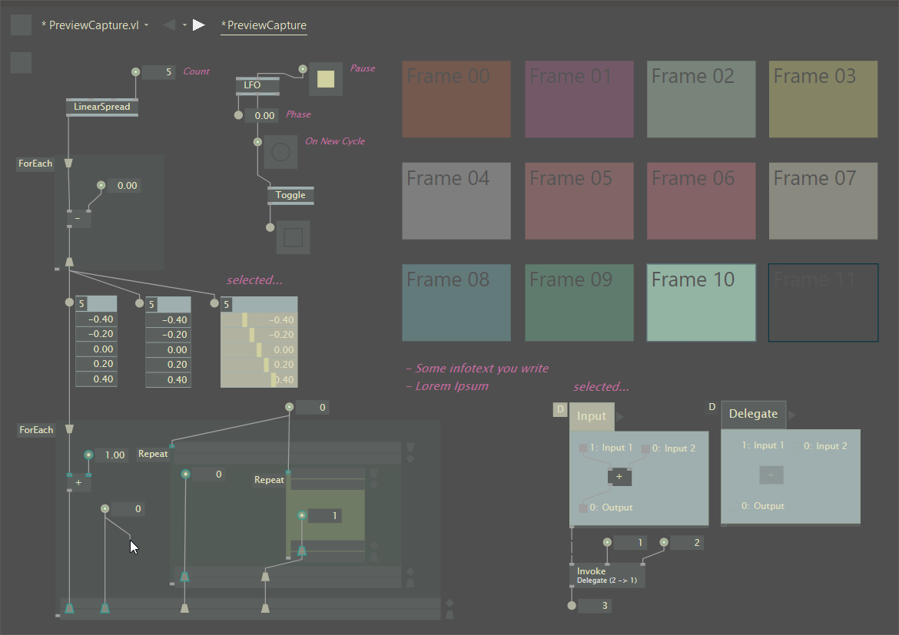
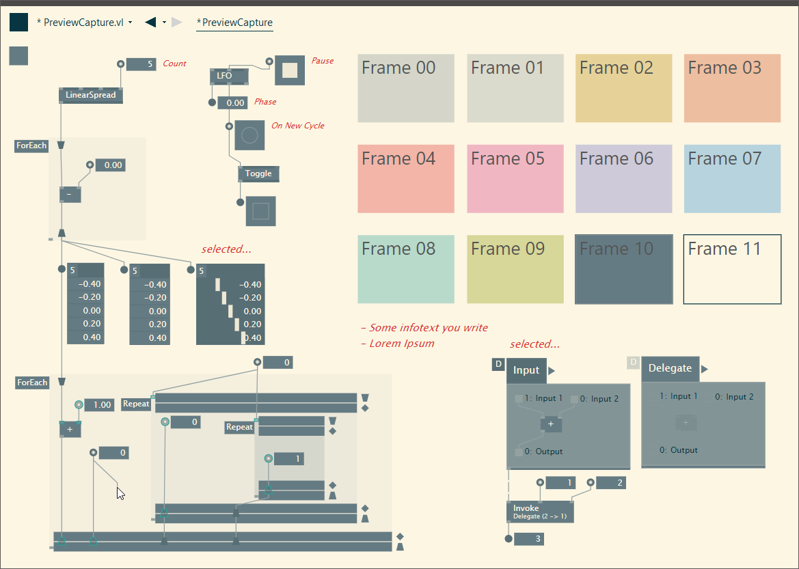

# GammaThemes
CSS themes for vvvv gamma

## Was ist das
This repo will gather CSS stylesheets for vvvv gamma.

## Usage
```
This is still a WIP, stylesheet are not uploaded to the release section yet. For now, you'll have to download or clone the repo.
```
Download the stylesheets from the release section and paste them in `Program Files\vvvv\vvvv_gamma_YYYY.N.N\lib\Stylesheets`. Then, edit the `Stylesheet` property of gamma's config file with the stylesheet you wanna use

## Themes

### In progress
- Solarized Light
- Zenburn
- GaSoMo
  - ( __Ga__ mmaTheme inspired by __So__ larized Dark and __Mo__ nokai )

### Planed
- Solarized Dark
- Dracula
    - Might be tough since the color palette is actually pretty limited

### Sources
- [Solarized](https://en.wikipedia.org/wiki/Solarized_(color_scheme))
- [Dracula](https://github.com/dracula/dracula-theme)
- [Zenburn](danson.grafidog.com/2010/10/zenburn-color-chart.html)

## Screenshots

### Zenburn


### Solarized Light


### GaSoMo
